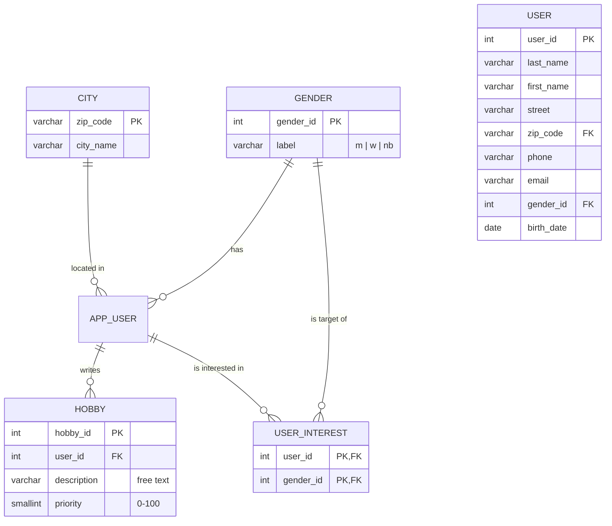

```mermaid
erDiagram
    CITY {
        varchar zip_code PK
        varchar city_name
    }

    GENDER {
        int gender_id PK
        varchar label "m | w | nb"
    }

    USER {  
        int user_id PK
        varchar last_name
        varchar first_name
        varchar street
        varchar zip_code FK
        varchar phone
        varchar email
        int gender_id FK
        date birth_date
    }

    HOBBY {
        int hobby_id PK
        int user_id FK
        varchar description "free text"
        smallint priority "0-100"
    }

    USER_INTEREST {
        int user_id PK,FK
        int gender_id PK,FK
    }

    CITY      ||--o{ APP_USER      : "located in"
    GENDER    ||--o{ APP_USER      : "has"
    APP_USER  ||--o{ HOBBY         : "writes"
    APP_USER  ||--o{ USER_INTEREST : "is interested in"
    GENDER    ||--o{ USER_INTEREST : "is target of"
```