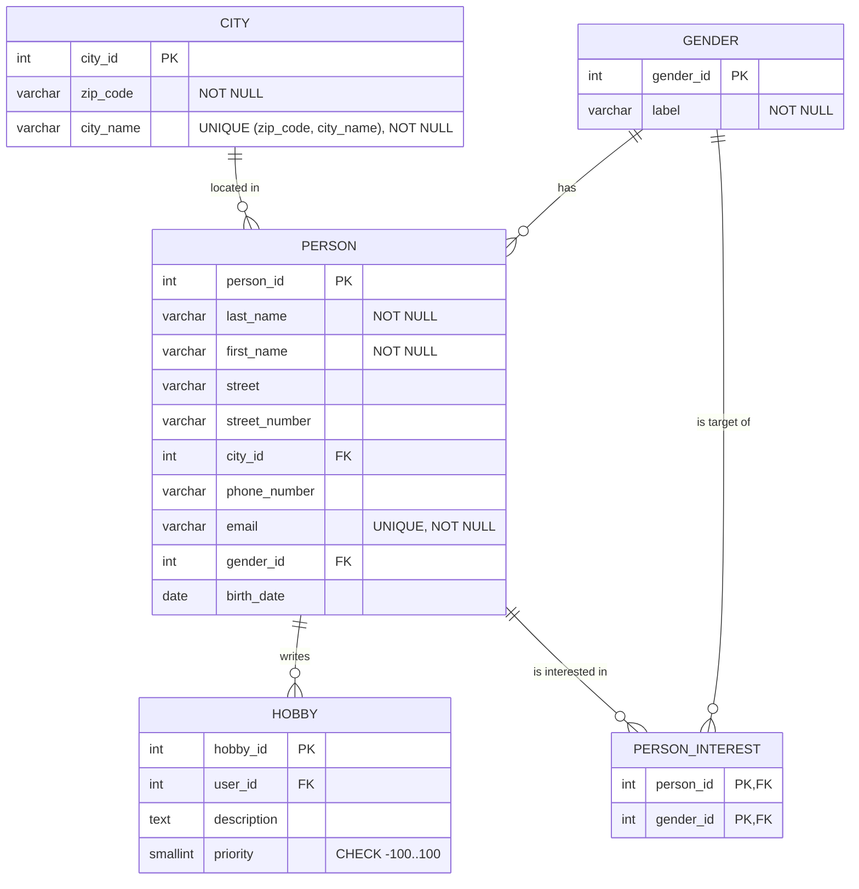
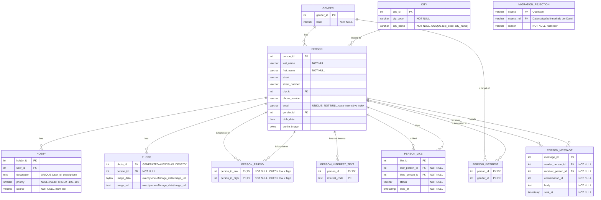

# Befundnotiz – LetsMeet-Datenmigration

---

### 13.8.2026 

- Wir habens uns für Java für die Programmiersprache des Projektes entschieden.
- Für Bibliotheken haben wir uns für JDBC mit dem Postgres Driver für die Datenbank verbindung entschieden und für das Auslesen von Excel daten verwenden wir Apache POI.
- Wir haben das basis Auslesen der Excel daten und die Vorlage für die Datenbank verbindung implementiert.

### 19.8.2026

- Wir haben das Datenschema für die Datenbank-Tabellen entwickelt:

Dieses Schema bringt die Daten bis in die dritte Normalform.

- Wir haben uns dafür entschieden, Datenmodelle (Java Records) für die verschiedenen Tabellen zu erstellen, damit die migration im code Strukturierter vorgeht
- Wir haben das Einlesen der Modelle und die Migration in die Datenbank implementiert.
- Wir haben das Prüfungsskript ausgeführt und erfolgreich bestanden. Wir hatten nur den warnhinweis von ``"Im Bestand: 15 Postleitzahlen mit führender Null 
  (Quelle: 15). 58 Personen mit vierstelliger Postleitzahl (Quelle: 58)."`` bekommen.

### 27.8.2026

- Wir führen Excel und MongoDB über die E-Mail-Adresse ohne Beachtung der
  Groß-/Kleinschreibung zusammen. In den Views bleibt trotzdem die Schreibweise aus Excel erhalten,
  weil der V2-Datenvertrag dies ausdrücklich verlangt.
- Bei widersprüchlichen Profilfeldern gilt die eingeholte Kundinnenentscheidung `MONGO_WINS`:
  MongoDB gewinnt bei Vorname, Nachname und Telefonnummer, Excel ergänzt nur fehlende Werte. Gegen
  einen allgemeinen Vorrang von Excel haben wir uns entschieden, weil die MongoDB-Daten die
  nachgelieferte Quelle für diese Profilangaben sind.

### 28.8.2026

- Das Zielmodell speichert genau ein Profilbild direkt in `PERSON.profile_image`. Weitere Fotos
  liegen in `PHOTO` und enthalten entweder Binärdaten oder eine URL, niemals beides. Die MongoDB-
  Lieferung besitzt kein Foto-, Bild- oder Avatar-Feld; deshalb erfinden wir keine Platzhalter und
  importieren aktuell keine Fotos.
- Freundschaften speichern wir als symmetrische Beziehung in `PERSON_FRIEND` und jedes Paar nur
  einmal in kanonischer Reihenfolge (`person_id_low < person_id_high`). Eine gerichtete Speicherung
  wie bei Likes haben wir verworfen, weil eine Freundschaft beiden Personen zugeordnet ist. Alle
  1.576 gelieferten `friends`-Arrays sind leer; ohne belegtes Elementformat importieren wir daraus
  keine Beziehungen.
- Namen, Kontaktdaten, Interessen, Nachrichten und Bilder sind personenbezogen. Interessen können
  zudem Rückschlüsse auf besonders geschützte Angaben zulassen. Deshalb verarbeitet der Import die
  Daten nur lokal und protokolliert bei Konflikten keine Feldwerte.

### 3.9.2026

- Die Anwendung wurde in die Schichten `application`, `assembly`, `source` und
  `target.postgres` aufgeteilt. Die Datenbankmigration verwendet spezialisierte
  Writer je Tabelle und einen gemeinsamen Batch-Inserter, damit Verantwortlichkeiten
  getrennt und Änderungen gezielter möglich sind.
- Das Transferpaket `letsmeet-transfer-v3` wird Datensatz für Datensatz validiert.
  Nicht übernehmbare Datensätze werden mit Quelldatei, Datensatzpfad und Begründung
  über [`RejectionWriter.java`](../src/main/java/org/encoway/migration/target/postgres/RejectionWriter.java)
  in der Tabelle `migration_rejection` dokumentiert. Gültige Datensätze derselben
  Lieferung werden trotzdem verarbeitet.
- Bei Transferpaket-Likes werden fehlende Pflichtangaben (`status` und Zeitstempel)
  nicht erfunden. Solche Datensätze werden abgelehnt. Hobbys werden als Fakt aus
  Person und Beschreibung dedupliziert. Bereits vorhandene Zuordnungen haben Vorrang.
- Die Datenbankmigration läuft als Gesamttransaktion. Vor jeder einzelnen
  Transferpaket-Einfügung wird ein Savepoint gesetzt. Schlägt die Einfügung fehl,
  wird nur bis zu diesem Savepoint zurückgerollt und der Datensatz als Ablehnung
  dokumentiert. Die übrigen Datensätze werden weiterverarbeitet. Ein schwerer
  Fehler außerhalb dieser Einzelfälle rollt weiterhin die gesamte Migration zurück.
- XML-Dateien werden ohne DTDs und externe Entitäten eingelesen. Als
  Kodierungsfehler gelten nicht lesbare Zeichenfolgen, die beim Einlesen durch das
  Ersatzzeichen `U+FFFD` ersetzt wurden. Sentinel-Profile enthalten nur Platzhalter
  für unbekannte Werte, konkret das Geburtsdatum `01.01.1900` und den Ort
  `unbekannt`, und werden deshalb abgelehnt. Mojibake bezeichnet falsch dekodierten
  Text wie `Müller` statt `Müller`. Eindeutig erkennbares Mojibake wird repariert,
  korrekt kodierte Werte bleiben unverändert.

#### Zielmodell

Ergänzt am 09.09.2026 um Hobby-Herkunft, Eindeutigkeit und Ablehnungen.
`PHOTO` und `PERSON_FRIEND` gehören zum geplanten Zielmodell, werden vom aktuellen Import
aber nicht angelegt. Die übrigen Tabellen sind in PostgreSQL vorhanden.

### 09.09.2026

Nachtrag zum vorhandenen Stand. Die älteren Einträge bleiben als Verlauf erhalten.
Ergänzungen am Modell sind gesondert datiert.

- Der Import ist eine Java-21-Konsolenanwendung, kein eigener Webserver. Die Kundinnen-App
  liest die `migration_*`-Views. So bleiben die internen Tabellen von der vereinbarten
  Schnittstelle getrennt.
- Der Ablauf ist: Excel und MongoDB lesen, Profile und Beziehungen zusammenführen,
  Hobby-XML ergänzen, PostgreSQL neu aufbauen, Transferpaket einspielen und Views anlegen.
  Die Java Records in `model` reichen die Daten zwischen diesen Schritten weiter.

Zum Nachvollziehen im Code:

| Stelle | Aufgabe |
| --- | --- |
| [`Main`](../src/main/java/org/encoway/Main.java) / [`MigrationRunner`](../src/main/java/org/encoway/migration/application/MigrationRunner.java) | Einstieg, Startargument und Reihenfolge des Imports. |
| [`source`](../src/main/java/org/encoway/migration/source) | Excel, MongoDB und XML lesen und in Java-Daten umwandeln. |
| [`assembly`](../src/main/java/org/encoway/migration/assembly) | Profilkonflikte lösen und E-Mail-Verweise auf Personen-IDs abbilden. |
| [`DatabaseMigrator`](../src/main/java/org/encoway/migration/target/postgres/DatabaseMigrator.java) | Transaktion, Neuaufbau und Schreiben über die Tabellen-Writer. Ruft auch die Transferpaket-Verarbeitung auf. |
| [`SchemaDefinition`](../src/main/java/org/encoway/migration/target/postgres/SchemaDefinition.java) / [`MigrationViews`](../src/main/java/org/encoway/migration/target/postgres/MigrationViews.java) | Tatsächlich angelegte Tabellen, Regeln und Views. Hier steht auch die DDL. |

- Jeder Lauf löscht und erstellt die vom Import verwalteten Tabellen und Views neu,
  einschließlich der Ablehnungen. Das ist ein vollständiger Neuaufbau, kein Update eines
  laufenden Bestands. Manuelle Änderungen in diesen Tabellen gehen bei erfolgreichem Import verloren.
  Ein zweiter Lauf hängt deshalb keine weiteren Kopien an.
- Seit heute erwartet der Start genau ein Argument: `/transferpack/records/`.
  Das ist der Präfix für `source_ref`, z. B. `/transferpack/records/hobby[2]`,
  kein Dateipfad und keine Datenbank-URI. Der abschließende Schrägstrich gehört dazu.
  Ein anderer Präfix ist möglich, muss aber zu den vereinbarten Datensatzverweisen passen.
- Als Arbeitsverzeichnis brauchen wir das Projektverzeichnis, weil Excel, Hobby-XML und
  Transferpaket relativ dazu gesucht werden. Datenbankadressen werden durch das Startargument
  nicht geändert. Sie stehen in [`DatabaseConfig`](../src/main/java/org/encoway/migration/target/postgres/DatabaseConfig.java)
  und [`MongoDataReader`](../src/main/java/org/encoway/migration/source/mongo/MongoDataReader.java).
- Excel bleibt der Personen-Grundbestand. Reine MongoDB-Profile werden nicht als neue Personen
  angelegt. Adresse, Geburtsdatum, Geschlecht und Interessen bleiben aus Excel. `MONGO_WINS`
  betrifft nur Vorname, Nachname und Telefon. Neue Personen können über Transferprofile dazukommen.
- Namen und Adressen aus Excel werden nicht pauschal getrimmt. Getrennt wird an `Komma + Leerzeichen`.
  Weitere Kommas gehören zum Ort. Postleitzahlen bleiben Text: führende Nullen bleiben erhalten,
  vierstellige Werte werden nicht ohne belegte Korrektur auf fünf Stellen aufgefüllt.
- Hobby-XML liefert keine Prioritäten. Wir speichern dafür `NULL`, nicht `0`, weil unbekannt
  nicht neutral bedeutet. `source` hält `excel` oder `xml` fest. Bei gleicher Person und
  Hobbybeschreibung bleibt die erste Zuordnung bestehen, auch über Quellgrenzen hinweg.
- Die Fehlerbehandlung ist nicht überall gleich: Unbekannte Personenverweise aus MongoDB
  brechen den Import ab. Im Hobby-XML werden nicht zuordenbare Personen ohne Ablehnungszeile
  übersprungen. Die datensatzweisen Ablehnungen gelten für das Transferpaket, nicht für alle Quellen.
  Auch dort brechen z. B. unlesbare XML-Dateien oder nicht numerische Prioritäten den Lauf ab.
- Eine Ablehnung ist durch Quelldatei und `source_ref` eindeutig, nicht durch die E-Mail.
  Damit bleiben auch zwei fehlerhafte Datensätze derselben Person unterscheidbar.
  Sichtbar werden sie über `migration_rejections`.
- Unser [Zielmodell](#zielmodell) ist direkt in dieser Befundnotiz hinterlegt und heute ergänzt.
  Dieser interne Link ersetzt nicht die geforderte ERD-Share-URL aus der Modellierungsstation.
  Die Share-URL liegt hier noch nicht vor.
- Es sind keine Fotos geliefert oder in `profile_image` hinterlegt. Deshalb importieren wir
  keine Bilder und erfinden keine Platzhalter. Die Kundinnen-App hat außerdem keine Foto-
  oder Freundeslistenanzeige. Das ist getrennt von den noch nicht angelegten Tabellen
  `PHOTO` und `PERSON_FRIEND` zu betrachten.
- Der Container-Verlauf enthält bereits erfolgreiche CLI-Abschlüsse für V2 vom 02.09.2026
  und V3 vom 03.09.2026. Bei V3 wurde auch der Snapshot-Vergleich zur Idempotenz bestanden.
  Die vorherige Aussage zum fehlenden V3-Nachweis war falsch. Der Verlauf liegt im App-Container
  in `/data/check-history.jsonl`, der Vergleichsstand in `/data/v3-snapshot.json`.

#### Quellmodell und Umsetzung

- Wir lesen die gelieferten Quellen, ohne ihre Struktur umzubauen. Die Reader bilden die
  Quellfelder auf Java Records ab. Erst beim Schreiben nach PostgreSQL entstehen relationale
  Tabellen mit Primärschlüsseln, Fremdschlüsseln und Prüfregeln.

| Quelle | Gespeicherte Struktur und Umsetzung |
| --- | --- |
| [Excel-Datei](../Lets%20Meet%20DB%20Dump.xlsx) | Erstes Blatt, erste Zeile als Kopf. Acht Spalten für Name, Adresse, Telefon, Hobbys, E-Mail, Geschlecht, Interessen und Geburtsdatum. Die Spaltenzuordnung und Zerlegung stehen im [ExcelRowMapper](../src/main/java/org/encoway/migration/source/excel/ExcelRowMapper.java). |
| MongoDB `LetsMeet.users` | Ein BSON-Dokument je Person. `_id` ist die E-Mail und der eindeutige Schlüssel. `_id`, `name` und `phone` sind Strings. `likes`, `messages` und `friends` sind Arrays. Eingelesen wird über den [MongoDataReader](../src/main/java/org/encoway/migration/source/mongo/MongoDataReader.java) in [MongoData](../src/main/java/org/encoway/migration/model/MongoData.java) und die darin verwendeten Records. |
| [Hobby-XML](../Lets_Meet_Hobbies.xml) | `user`-Elemente mit `email` und mehreren `hobby`-Texten. Die Zuordnung zu vorhandenen Personen und die Deduplizierung stehen im [HobbyXmlReader](../src/main/java/org/encoway/migration/source/xml/HobbyXmlReader.java). |
| [Transferpaket](../letsmeet-transfer-v3) | XML-Datensätze für Likes, Hobbys und Profile. Dateinamen und Datensatzverweise stehen im [Manifest](../letsmeet-transfer-v3/manifest.json). Die Feldprüfung steht im [TransferPackageProcessor](../src/main/java/org/encoway/migration/source/transfer/TransferPackageProcessor.java). |

- Mongo-Likes enthalten `liked_email`, `status` und `timestamp` als Strings.
  Nachrichten enthalten `receiver_email`, `message` und `timestamp` als Strings sowie
  `conversation_id` als BSON-Integer. Zeittexte werden beim Lesen zu `LocalDateTime`.
  Verweise auf andere Personen werden über die E-Mail aufgelöst.
- Die MongoDB-Sammlung hat aktuell keinen Schema-Validator. Für Excel und XML haben wir
  keine eigene Schema-Definition angelegt. Die Reader und Records beschreiben den von uns
  verarbeiteten Ausschnitt, sind aber keine Quell-DDL.
- Die ausführbare PostgreSQL-DDL steht in
  [SchemaDefinition](../src/main/java/org/encoway/migration/target/postgres/SchemaDefinition.java),
  die View-Definitionen in
  [MigrationViews](../src/main/java/org/encoway/migration/target/postgres/MigrationViews.java).
  Es gibt dafür keine zusätzliche SQL-Datei.

#### Views und Anwendungsfälle

- An den geforderten Views fehlt nach dem gespeicherten V3-Abschluss keine Vertragsspalte.
  Vorhanden sind `migration_users`, `migration_user_interests`, `migration_user_hobbies`,
  `migration_likes`, `migration_messages` und `migration_rejections`.
- Foto- und Freundschafts-Views sind im vorliegenden Datenvertrag nicht gefordert.
  Offen sind eigene SQL-Beispiele je Anwendungsfall aus der [README](../readme.md#modellierungsauftrag),
  etwa Stammdaten ändern, Hobbys priorisieren, ähnliche Interessen finden oder Freundschaften
  zuordnen. Das sind keine fehlenden Spalten der Anzeige-Views.

#### Datenschutz

- Die Anforderung steht in der [README unter Modellierungsauftrag](../readme.md#modellierungsauftrag):
  Datenarten, Rechtsgrundlage, Schutzbedarf und technische sowie organisatorische Maßnahmen.
  Die Notiz vom 28.8. beschreibt bisher vor allem Datenarten und einzelne Schutzmaßnahmen.
- Vor der Verarbeitung echter Personendaten muss die verantwortliche Stelle die Rechtsgrundlage
  nach Art. 6 DSGVO klären und dokumentieren. Bei Angaben zur sexuellen Orientierung ist zusätzlich
  eine Ausnahme nach Art. 9 nötig. Eine wirksame ausdrückliche Einwilligung kann dafür infrage
  kommen, ist hier aber nicht belegt. Bei einem externen Dienstleister ist auch Art. 28 zu klären.
- Technisch noch zu klären: Docker-Ports nur lokal oder für berechtigte Zugriffe freigeben,
  Standardpasswörter ersetzen und Zugangsdaten außerhalb des Codes verwalten. Die Anzeige-App
  sollte nur Leserechte auf ihre Views erhalten. Aktuell veröffentlichen die Container ihre
  Ports auf allen Host-Schnittstellen. Lokal gestartet bedeutet nicht automatisch abgeschottet.
- Organisatorisch noch festzulegen: Wer darf Daten und Exporte sehen, wer ist verantwortlich
  und wann werden Arbeitskopien, Backups und Prüfstände gelöscht. Echte Personendaten gehören
  nicht in öffentliche Repositories, Screenshots oder externe KI-Dienste.
- Logs und Ablehnungen ebenfalls schützen. Profilkonflikte enthalten keine Feldwerte,
  SQL-Fehlermeldungen können aber betroffene Werte enthalten. Exporte vorher prüfen und bei
  Bedarf schwärzen. Für echte Daten auch Geräte und Sicherungen verschlüsseln.
