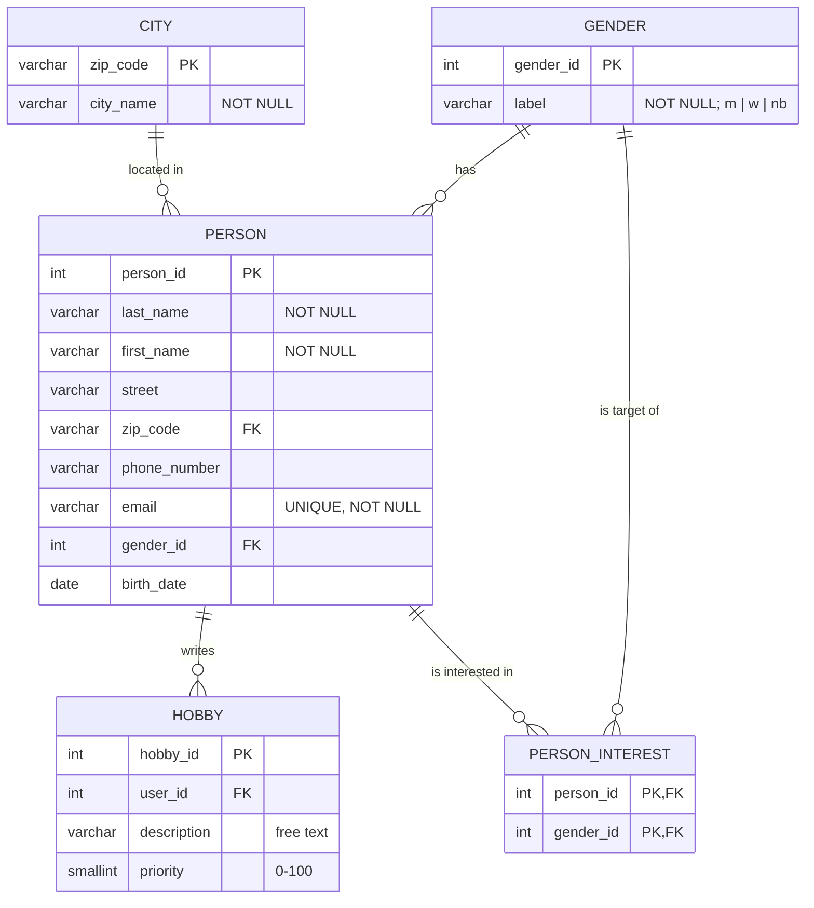

# Befundnotiz – LetsMeet-Datenmigration

**Zielschema (relationales Modell / ERD):**

---

### 2026-08-19
- **Zielschema in die 3. Normalform gebracht.** Wiederholgruppen und Mehrfach-Zielgeschlechter
  aus einzelnen Spalten in eigene Relationen ausgelagert; Verweise über Fremdschlüssel.
  Grundlage für Modell und Import ist damit `databaseSchema.md`.
- **Pfad gefixt.** Verbindungs-/Zielpfad korrigiert, sodass der Import gegen die richtige
  Datenbank `lf8_lets_meet_db` läuft.
- **Nächster Schritt festgelegt:** Der `DatabaseMigrator` wird anhand dieses Schemas erstellt
  (DDL + Import), nicht frei improvisiert.
