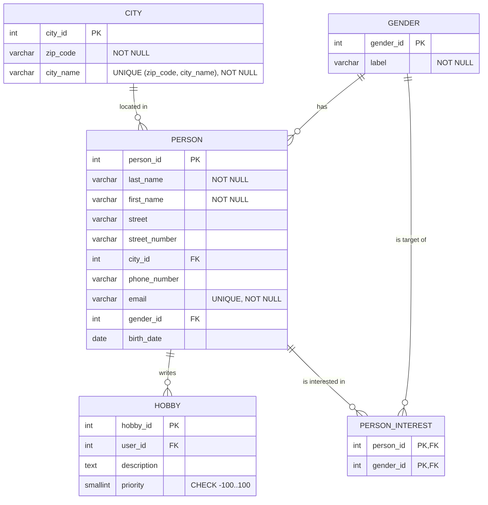
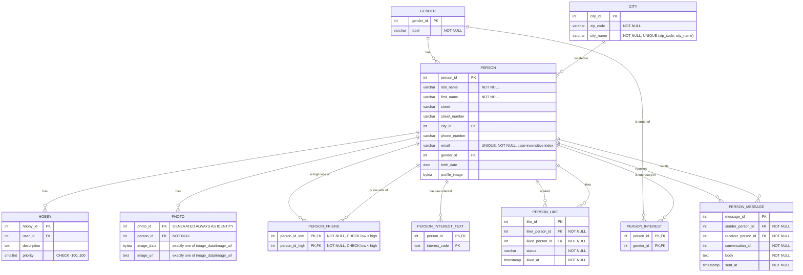

# Befundnotiz – LetsMeet-Datenmigration

---

### 13.8.2026 

- Wir habens uns für Java für die Programmiersprache des Projektes entschieden.
- Für Bibliotheken haben wir uns für JDBC mit dem Postgres Driver für die Datenbank verbindung entschieden und für das Auslesen von Excel daten verwenden wir Apache POI.
- Wir haben das basis Auslesen der Excel daten und die Vorlage für die Datenbank verbindung implementiert.

### 19.8.2026

- Wir haben das Datenschema für die Datenbank-Tabellen entwickelt:

Dieses Schema bringt die Daten bis in die dritte Normalform.

- Wir haben uns dafür entschieden, Datenmodelle (Java Records) für die verschiedenen Tabellen zu erstellen, damit die migration im code Strukturierter vorgeht
- Wir haben das Einlesen der Modelle und die Migration in die Datenbank implementiert.
- Wir haben das Prüfungsskript ausgeführt und erfolgreich bestanden. Wir hatten nur den warnhinweis von ``"Im Bestand: 15 Postleitzahlen mit führender Null 
  (Quelle: 15). 58 Personen mit vierstelliger Postleitzahl (Quelle: 58)."`` bekommen.

### 27.8.2026

- Wir führen Excel und MongoDB über die E-Mail-Adresse ohne Beachtung der
  Groß-/Kleinschreibung zusammen. In den Views bleibt trotzdem die Schreibweise aus Excel erhalten,
  weil der V2-Datenvertrag dies ausdrücklich verlangt.
- Bei widersprüchlichen Profilfeldern gilt die eingeholte Kundinnenentscheidung `MONGO_WINS`:
  MongoDB gewinnt bei Vorname, Nachname und Telefonnummer, Excel ergänzt nur fehlende Werte. Gegen
  einen allgemeinen Vorrang von Excel haben wir uns entschieden, weil die MongoDB-Daten die
  nachgelieferte Quelle für diese Profilangaben sind.

### 28.8.2026

- Das Zielmodell speichert genau ein Profilbild direkt in `PERSON.profile_image`. Weitere Fotos
  liegen in `PHOTO` und enthalten entweder Binärdaten oder eine URL, niemals beides. Die MongoDB-
  Lieferung besitzt kein Foto-, Bild- oder Avatar-Feld; deshalb erfinden wir keine Platzhalter und
  importieren aktuell keine Fotos.
- Freundschaften speichern wir als symmetrische Beziehung in `PERSON_FRIEND` und jedes Paar nur
  einmal in kanonischer Reihenfolge (`person_id_low < person_id_high`). Eine gerichtete Speicherung
  wie bei Likes haben wir verworfen, weil eine Freundschaft beiden Personen zugeordnet ist. Alle
  1.576 gelieferten `friends`-Arrays sind leer; ohne belegtes Elementformat importieren wir daraus
  keine Beziehungen.
- Namen, Kontaktdaten, Interessen, Nachrichten und Bilder sind personenbezogen. Interessen können
  zudem Rückschlüsse auf besonders geschützte Angaben zulassen. Deshalb verarbeitet der Import die
  Daten nur lokal und protokolliert bei Konflikten keine Feldwerte. Die konkrete

