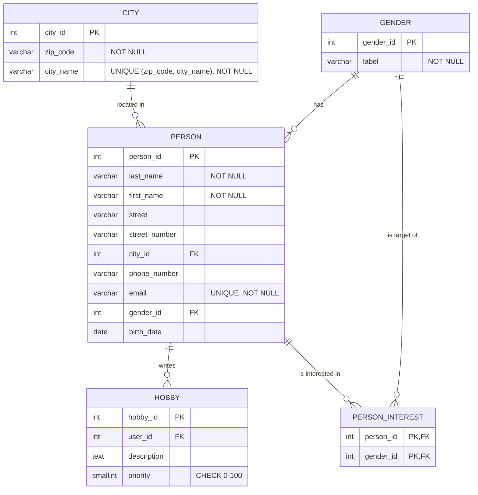

# Befundnotiz – LetsMeet-Datenmigration

---

### 13.8.2026 

- Wir habens uns für Java für die Programmiersprache des Projektes entschieden.
- Für Bibliotheken haben wir uns für JDBC mit dem Postgres Driver für die Datenbank verbindung entschieden und für das Auslesen von Excel daten verwenden wir Apache POI.
- Wir haben das basis Auslesen der Excel daten und die Vorlage für die Datenbank verbindung implementiert.

### 19.8.2026

- Wir haben das Datenschema für die Datenbank-Tabellen entwickelt:

Dieses Schema bringt die Daten bis in die dritte Normalform.

- Wir haben uns dafür entschieden, Datenmodelle (Java Records) für die verschiedenen Tabellen zu erstellen, damit die migration im code Strukturierter vorgeht
- Wir haben das Einlesen der Modelle und die Migration in die Datenbank implementiert.
- Wir haben das Prüfungsskript ausgeführt und erfolgreich bestanden. Wir hatten nur den warnhinweis von ``"Im Bestand: 15 Postleitzahlen mit führender Null 
  (Quelle: 15). 58 Personen mit vierstelliger Postleitzahl (Quelle: 58)."`` bekommen.

